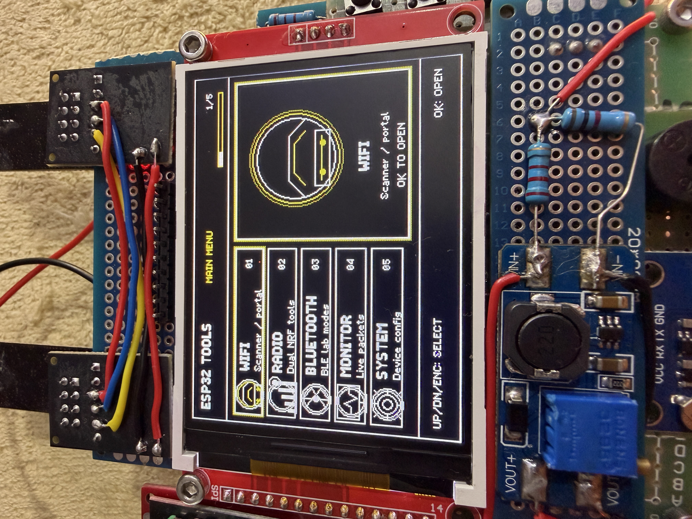
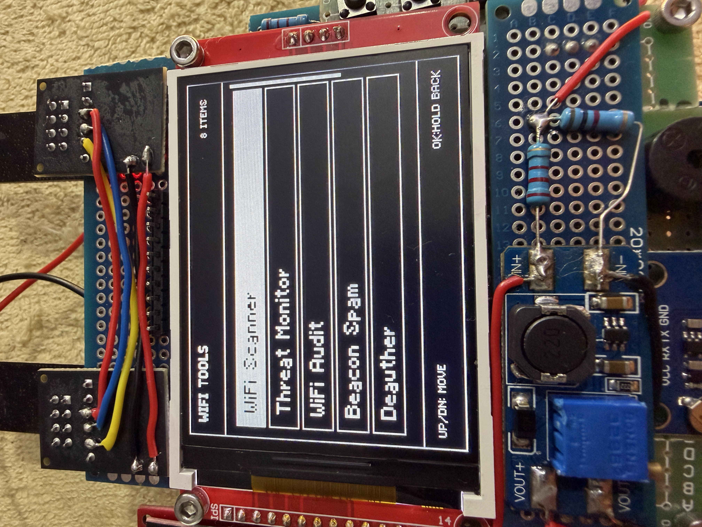
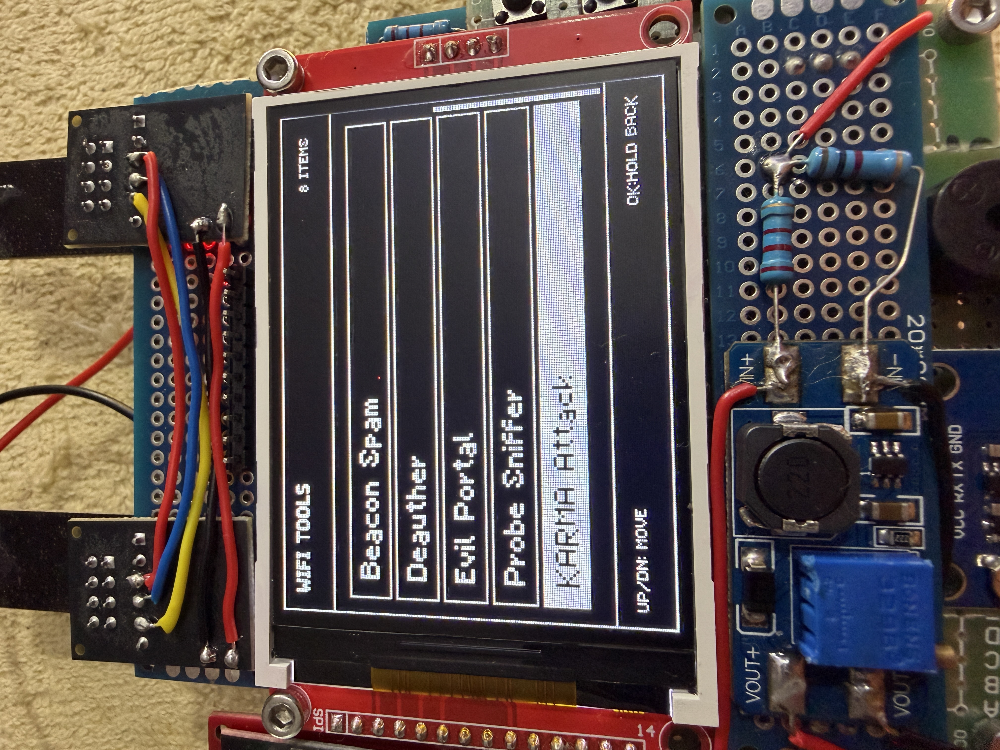
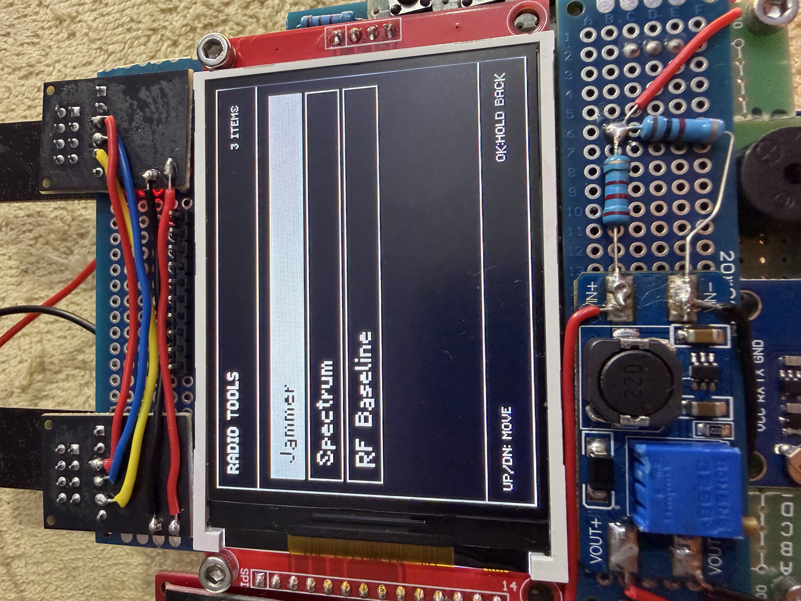
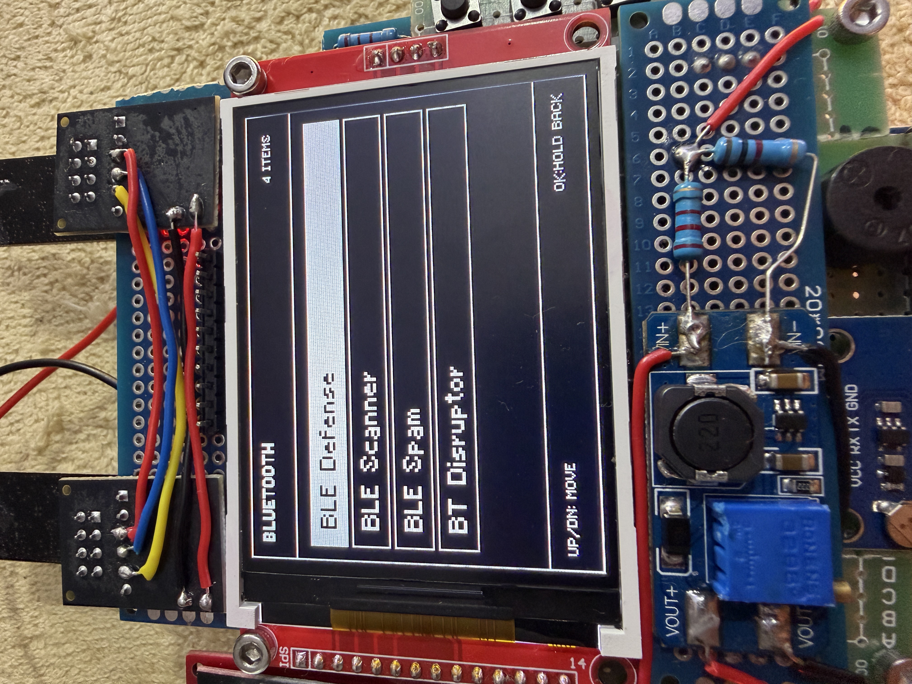
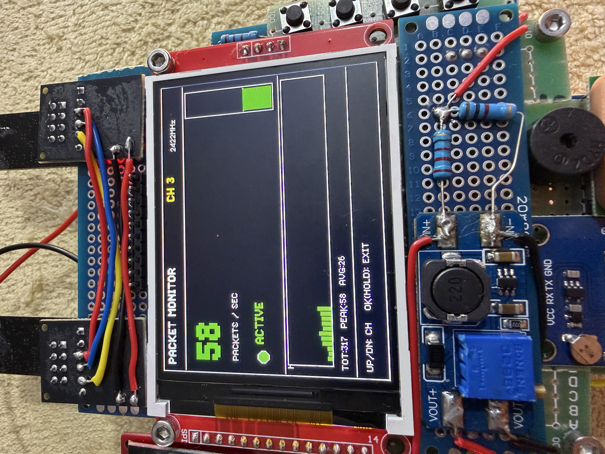
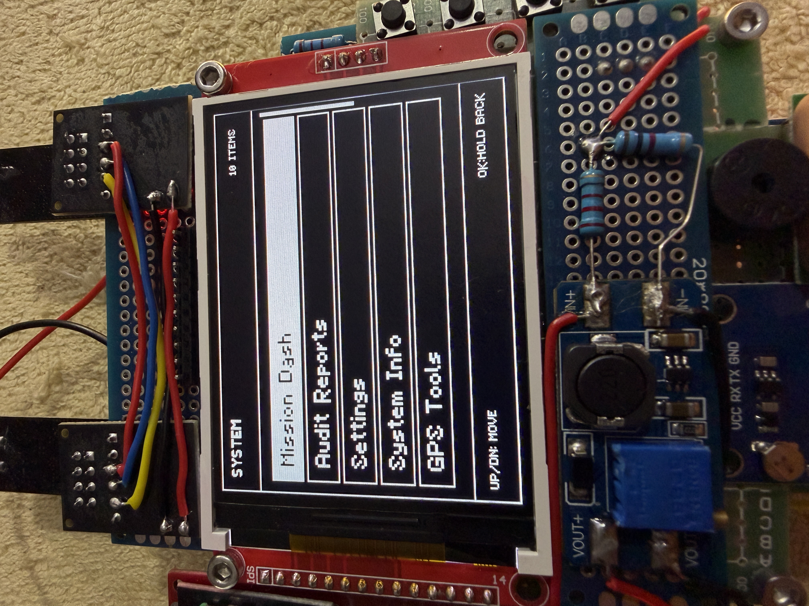
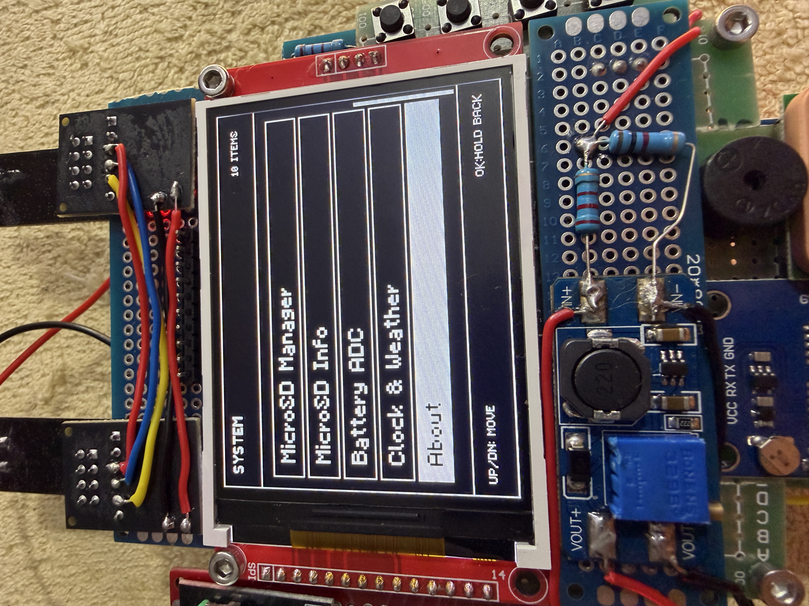
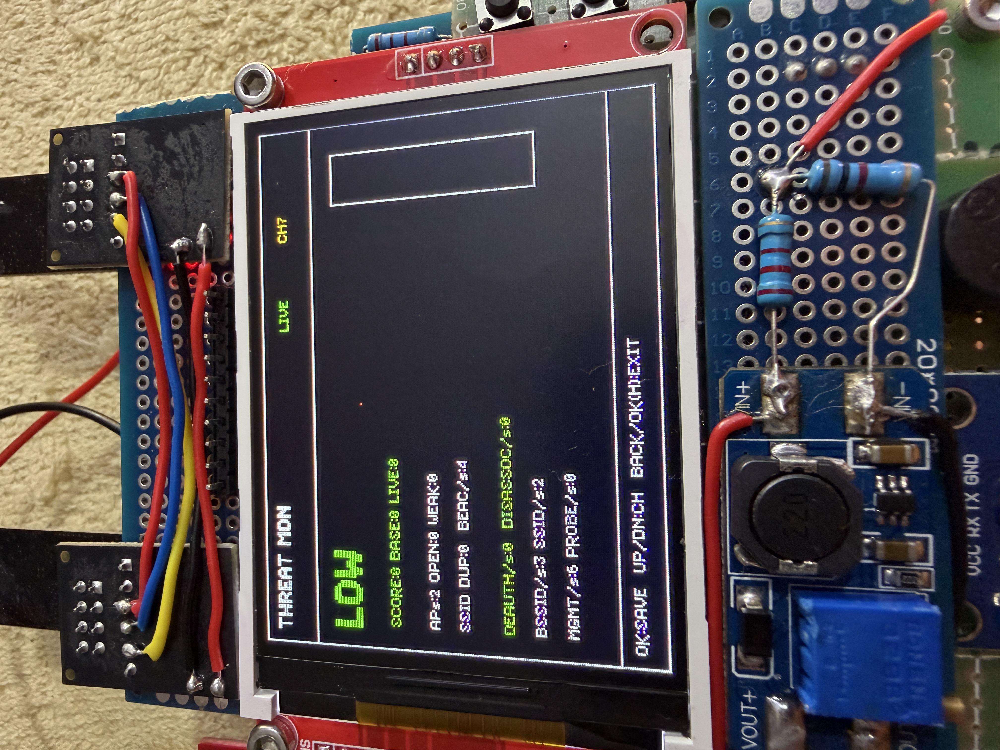

# CYBERDECK MINI ESP32

Firmware para un cyberdeck portatil basado en ESP32-S3, pantalla TFT ST7789 240x320, doble radio nRF24L01, GPS NEO-6M, microSD, encoder y botones fisicos. El proyecto esta pensado para aprendizaje, monitoreo defensivo, diagnostico de hardware y demostraciones de ciberseguridad dentro de un marco legal y etico.

> Usa este firmware solo en redes, laboratorios y dispositivos propios o con autorizacion explicita. Las herramientas de radio, WiFi y Bluetooth deben usarse de forma responsable para pruebas, auditoria y educacion.



## Estado del proyecto

- Interfaz adaptada a pantalla ST7789 240x320 en orientacion horizontal.
- Navegacion con 4 botones y encoder.
- Splash de inicio con ajolote conservado.
- MicroSD en bus SPI dedicado.
- GPS Tools Pro con dashboard, logger CSV, brujula por movimiento y waypoints.
- MicroSD Manager con browser, visor rapido de reportes, carpetas, indice y limpieza segura.
- Herramientas defensivas para WiFi, BLE y radio 2.4 GHz.
- Reportes exportables a microSD.

## Galeria

| Menu principal | WiFi tools |
| --- | --- |
|  |  |

| WiFi tools 2 | Radio tools |
| --- | --- |
|  |  |

| Bluetooth | Packet monitor |
| --- | --- |
|  |  |

| System | System tools |
| --- | --- |
|  |  |

| Threat monitor |
| --- |
|  |

## Hardware objetivo

- ESP32-S3 DevKitC-1 N8 o compatible.
- Pantalla TFT ST7789 SPI 240x320.
- 2 modulos nRF24L01.
- GPS NEO-6M por UART1.
- Lector microSD en SPI dedicado.
- Encoder rotativo con boton.
- 4 botones fisicos: UP, DOWN, ENTER y BACK.
- Buzzer.
- Lectura ADC de bateria mediante divisor resistivo 2.2k / 1k.

## Pinout usado

| Periferico | Funcion | GPIO |
| --- | --- | --- |
| TFT ST7789 | SCK | 12 |
| TFT ST7789 | MOSI | 11 |
| TFT ST7789 | MISO | 13 |
| TFT ST7789 | CS | 10 |
| TFT ST7789 | DC | 21 |
| TFT ST7789 | RST | 14 |
| nRF24 #1 | CE / CSN | 4 / 5 |
| nRF24 #2 | CE / CSN | 6 / 7 |
| microSD | SCK / MOSI / MISO / CS | 36 / 35 / 37 / 16 |
| GPS NEO-6M | RX / TX | 18 / 17 |
| Botones | UP / DOWN / ENTER / BACK | 1 / 2 / 42 / 41 |
| Encoder | CLK / DT / SW | 40 / 39 / 38 |
| Buzzer | Signal | 15 |
| Bateria ADC | VBAT | 9 |

## Navegacion

- `UP` / `DOWN`: mover seleccion.
- Encoder: mover seleccion en menus y herramientas compatibles.
- `ENTER` u OK: abrir, seleccionar o ejecutar accion.
- `BACK`: regresar o salir.
- OK mantenido: regreso alternativo o accion secundaria cuando la pantalla lo indique.

## Funciones principales

### WiFi

- WiFi Scanner con detalles de SSID, BSSID, canal, RSSI y seguridad.
- Threat Monitor defensivo para detectar actividad anomala como beacon spam o eventos de deauth/disassoc.
- WiFi Audit para revisar redes abiertas, debiles, ocultas o posibles clones.
- Probe Sniffer para observar probes de forma pasiva.
- Reportes exportables a microSD.

### Radio 2.4 GHz

- Spectrum analyzer con 3 modos visuales.
- RF Baseline defensivo para comparar actividad actual contra una linea base.
- Reporte `/RF_BASELINE.txt` en microSD.
- Soporte para doble nRF24L01.

### Bluetooth / BLE

- BLE Defense para auditoria pasiva de dispositivos cercanos.
- BLE Scanner con lista y detalles.
- Reporte `/BLE_AUDIT.txt` en microSD.

### GPS Tools Pro

- Dashboard Pro con fix, satelites, HDOP, edad, latitud, longitud, altitud, velocidad, rumbo y UTC.
- Track Logger en `/GPS_TRACK.csv`.
- Waypoint Mark en `/GPS_MARKS.csv`.
- Compass basado en rumbo GPS por movimiento.
- Snapshot en `/GPS_SNAPSHOT.txt`.
- Consola NMEA para diagnostico.

### MicroSD Manager

- Browser de archivos con visor de texto para `.txt`, `.csv`, `.log`, `.json`, `.md`, `.nmea` y `.gps`.
- Quick Reports para abrir reportes generados.
- Creacion de carpetas: `/GPS`, `/REPORTS`, `/LOGS`, `/EXPORTS`, `/CAPTURES`.
- Export SD Index en `/SD_INDEX.txt`.
- Clean Reports con confirmacion por OK mantenido.
- SD Info con tipo, tamano, uso y velocidad SPI.

### Sistema

- Mission Dashboard con estado general de bateria, GPS, SD y radios.
- Audit Reports.
- Battery ADC con estimacion para Li-ion/LiPo 1S.
- Clock & Weather.
- System Info.
- Settings.
- About.

## Archivos generados en microSD

| Archivo | Origen |
| --- | --- |
| `/GPS_TRACK.csv` | GPS Track Logger |
| `/GPS_MARKS.csv` | Dashboard Pro / Waypoint Mark |
| `/GPS_SNAPSHOT.txt` | Export Snapshot |
| `/THREAT_REPORT.txt` | Threat Monitor |
| `/WIFI_DEFENSE.txt` | WiFi Audit |
| `/WIFI_AUDIT.csv` | Audit Reports |
| `/RF_BASELINE.txt` | RF Baseline |
| `/BLE_AUDIT.txt` | BLE Defense |
| `/BATTERY_STATUS.txt` | Battery report |
| `/SD_INDEX.txt` | MicroSD Manager |

## Compilar

Instala PlatformIO y ejecuta:

```powershell
pio run
```

## Subir al ESP32-S3

Conecta el dispositivo por USB y ejecuta:

```powershell
pio run -t upload
```

Si PlatformIO no detecta el puerto, revisa el cable USB, drivers y modo BOOT del ESP32-S3.

## Estructura relevante

```text
include/      Headers del firmware
src/          Codigo principal
img/          Capturas usadas por este README
firmware/     Binarios para flasher/web tools
```

## Redes

- Instagram: https://instagram.com/pepeangelll
- Facebook: https://www.facebook.com/esp32tools/
- GitHub: https://github.com/pepeangell5

## Licencia

Consulta `LICENSE`.
